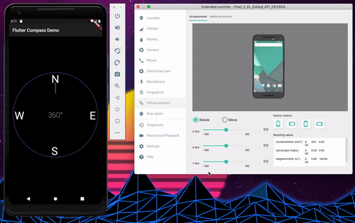

# Simple flutter compass

## Introduction
Simple compass using flutter_compass

```
# Install flutter
open https://flutter.dev/docs/get-started/install

# Launch a simulator / emulator or attach a device
flutter devices

# Run the app
flutter run
```

